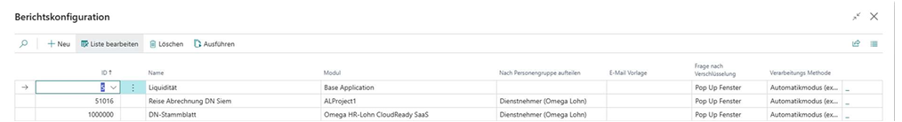

# Berichtskonfiguration

Auf der Seite **„Berichtskonfiguration“** legen Sie fest, welche Berichte für die weitere Verarbeitung freigeschaltet werden.

## Bericht auswählen

Geben Sie im Feld **„ID“** die ID des gewünschten Berichts ein. Die Felder **„Name“** und **„Modul“** werden anschließend automatisch befüllt.

## Nach Personengruppe aufteilen

Mit **„Nach Personengruppe aufteilen“** legen Sie fest, nach welchen Personengruppen der Bericht bei der Verarbeitung getrennt werden soll.

### Beispiel

- Der Bericht enthält Daten mehrerer Dienstnehmer.
- Ist die Option **„Nach Personengruppe aufteilen“** aktiviert, erstellt das System für jeden Dienstnehmer eine separate PDF-Datei.

Die Option wird automatisch vorbelegt und kann nachträglich geändert werden.

## Frage nach Verschlüsselung

Die Einstellung **„Frage nach Verschlüsselung“** legt fest, wann und auf welche Weise der Benutzer gefragt wird, ob die Daten verschlüsselt werden sollen.

Die Abfrage kann auf zwei Arten erfolgen:

- über ein Pop-up-Fenster
- über die Berichtsseite

Die Option wird automatisch vorbelegt. Sie kann nachträglich geändert werden, sofern der ausgewählte Bericht diese Funktion unterstützt.

## Verarbeitungsmethode

Mit **„Verarbeitungsmethode“** legen Sie fest, wie der Bericht verarbeitet wird.

| Methode | Beschreibung |
| --- | --- |
| **Automatikmodus** | Der Bericht wird dynamisch ausgewertet und nach der jeweiligen Personengruppe aufgeteilt. |
| **Performance-Modus** | Der Bericht wird mithilfe von Steuerstrings aufgeteilt. Diese Methode ermöglicht eine schnellere Verarbeitung, wird jedoch nicht von jedem Bericht beziehungsweise nicht immer in vollem Umfang unterstützt. |

Die Verarbeitungsmethode wird automatisch vorbelegt. Sie kann nachträglich geändert werden, sofern der ausgewählte Bericht die gewünschte Methode unterstützt.

## Verarbeitungsoptionen

Wählen Sie das **letzte Feld der Zeile**, um die Verarbeitungsoptionen zu öffnen. Dort können Sie festlegen, ob der Bericht:

- verschlüsselt,
- heruntergeladen oder
- verschlüsselt und heruntergeladen

werden soll.

::: warning Wichtig
Die Verarbeitungsoptionen sind besonders relevant, wenn **„Frage nach Verschlüsselung“** auf **„Steuerung über Berichtsseite“** gesetzt ist. In diesem Fall erfolgt während der Verarbeitung keine weitere Abfrage.
:::

