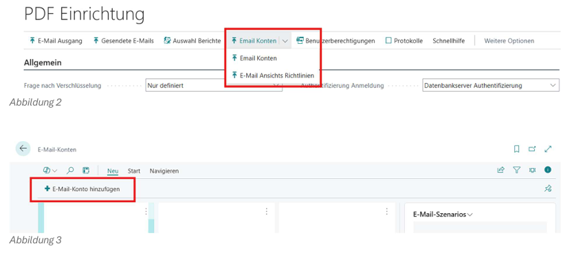

# E-Mail Einrichtung

## E-Mail-Konto Erstellen

Um in BC E-Mails versenden zu können, müssen zuerst E-Mail-Konten eingerichtet werden





Unter **E-Mail-Konto hinzufügen** können E-Mail-konten für Business Central eingerichtet werden.


::: warning Benutzer Berechtigungen
Der Benutzer, der mit dem angelegten E-Mail-Konto Mails versenden soll, muss auch die Berechtigungen dazu haben. (z,B. Max Mustermann kann nicht der E-Mail-Adresse für Frau Mustermann versenden) Dies muss intern bei ihrem z.B. Mail Server / Exchange erledigt werden.)
:::


## E-Mail-Anzeigerichtlinien für Benutzer


Öffnen Sie über die Suche in Business Central die Seite:

```text
E-Mail-Anzeigerichtlinien für Benutzer
```


Hier können Sie festlegen, welcher Benutzer welche E-Mails ansehen darf. 

:::tip
z.B. nur der Benutzer Max Mustermann darf alle E-Mail sehen. Frau Mustermann darf nur ihre eigenen sehen. Dies wird 
hierbei nur angewendet für versendet bzw., zur Vorschau gelegten Emails
:::


:::info
Für genauere Informationen lesen sie die Offiziele Dokumentation
[Einrichten von E-Mails in Business Central - Business Central | Microsoft Learn](https://learn.microsoft.com/de-de/dynamics365/business-central/admin-how-setup-email)
:::
