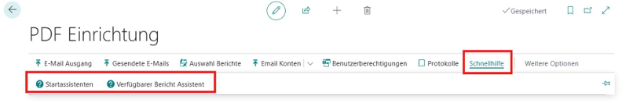

# Quick Setup

Unter „Schnellhilfe“ kann man zwei Assistenten starten, die die Einrichtungen für den Benutzer erleichtern.  

## Startassistent

Für die Benutzereinrichtung / Ersteinrichtung. Vergibt für den bestimmten Benutzer automatisch die richtigen Berechtigungen und führt den Benutzer durch die 
Einrichtungseinstellungen. 

## Verfügbarer Bericht Assistent

Hilfestellung zum Erstellen von Berichtskonfigurationen.